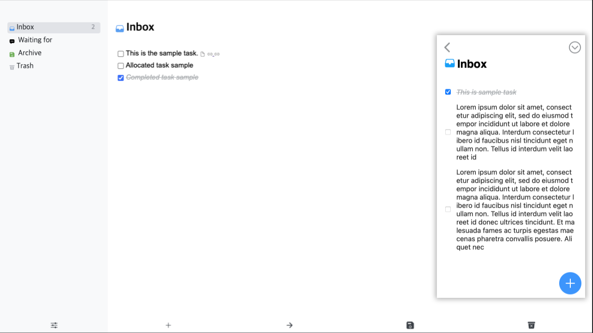

# Dawn

[](https://hub.docker.com/r/rvnk/dawn)
[](https://github.com/rvnkcode/dawn-web/actions/workflows/release-docker-image.yml)
[](https://github.com/rvnkcode/dawn-web/actions/workflows/test-image.yml)

Self-hosted Things 3 clone to-do application



## Deploy with Docker

### Docker Run

```bash
docker run -d --name dawn -p 3000:3000 -v ~/.dawn/:/memo rvnk/dawn:latest
```

### Docker Compose

Provided `docker-compose.yml` is [here](./docker-compose.yml).

```bash
docker-compose down && docker image rm rvnk/dawn:latest && docker-compose up -d
```

## Known Issues

- Selected task won't display properly on firefox browser because of `:has()` CSS selector([link](https://developer.mozilla.org/en-US/docs/Web/CSS/:has))

## Keyboard Shortcuts

| Keyboard shortcut | Description           |
| ----------------- | --------------------- |
| <kbd>Delete</kbd> | Delete selected tasks |
| <kbd>ESC</kbd>    | Hide input forms      |
